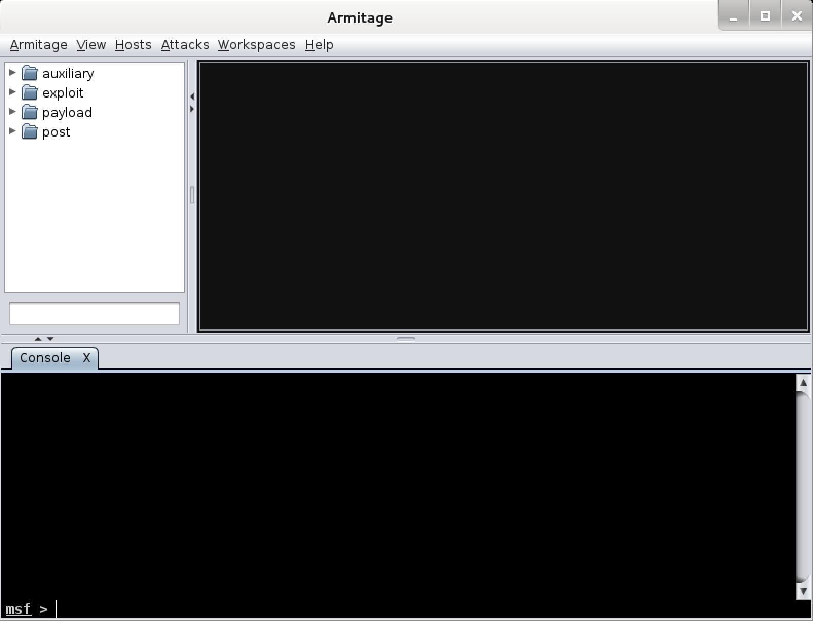

{}

## Screenshots



## armitage Usage Example

```
root@kali:~# armitage
[*] Starting msfrpcd for you.
```

## teamserver Usage Example

Start teamserver on the external IP (`192.168.1.202`) and set the server password (`s3cr3t`):

```
root@kali:~# teamserver 192.168.1.202 s3cr3t
[*] Generating X509 certificate and keystore (for SSL)
[*] Starting RPC daemon
[*] MSGRPC starting on 127.0.0.1:55554 (NO SSL):Msg...
[*] MSGRPC backgrounding at 2014-05-14 15:05:46 -0400...
[*] sleeping for 20s (to let msfrpcd initialize)
[*] Starting Armitage team server
[-] Java 1.6 is not supported with this tool. Please upgrade to Java 1.7
[*] Use the following connection details to connect your clients:
    Host: 192.168.1.202
    Port: 55553
    User: msf
    Pass: s3cr3t

[*] Fingerprint (check for this string when you connect):
    a3b60bef430037a6b628d9011924341b8c09081
[+] multi-player metasploit... ready to go
```
