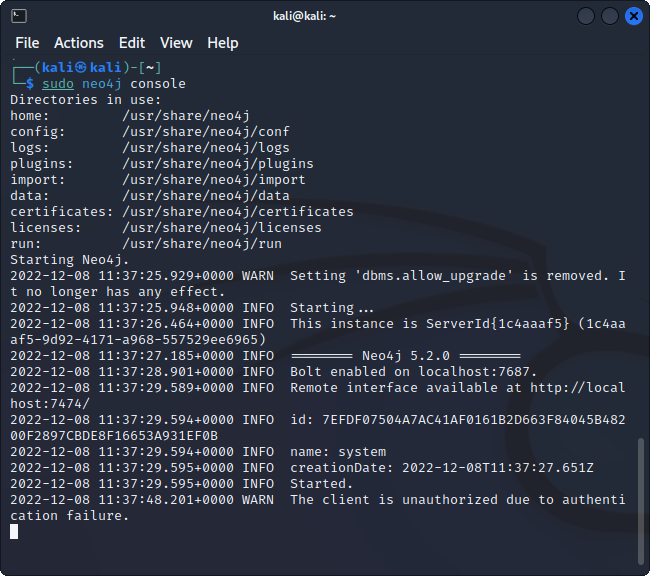
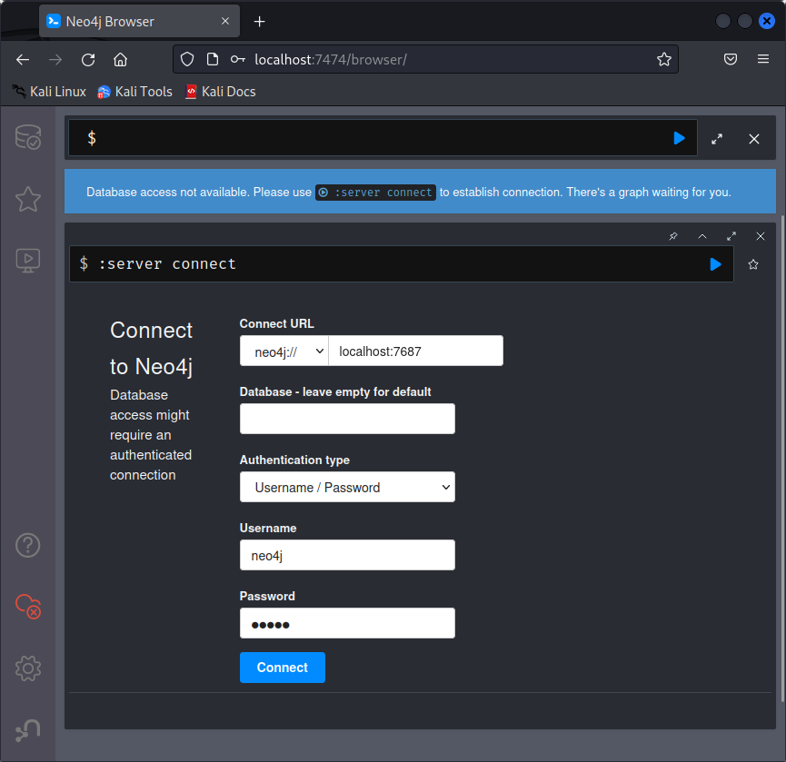
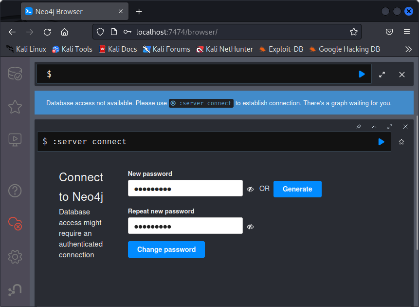
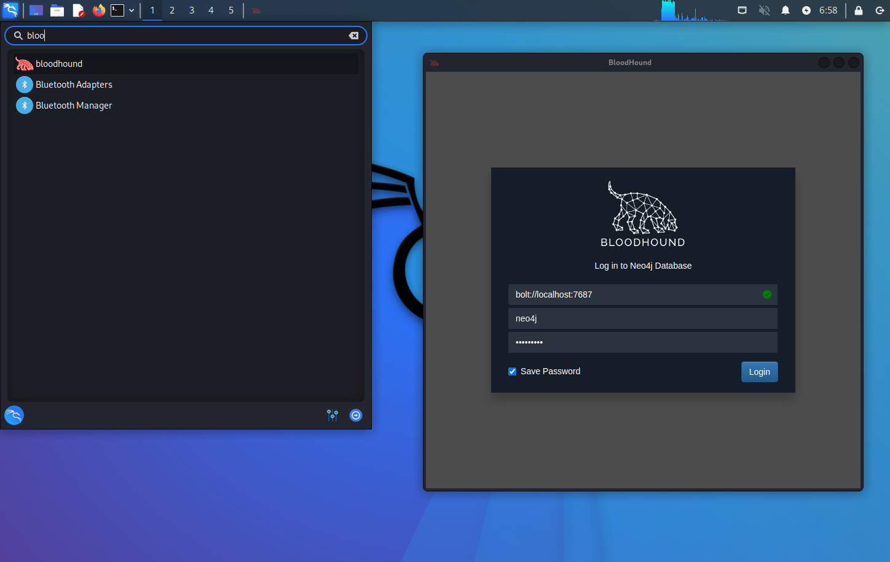

{}

## How to install and run Bloodhound

Install Bloodhound from the apt repository with:

```console
┌──(kali㉿kali)-[~]
└─$ sudo apt update && sudo apt install -y bloodhound
```

After installation completes, start neo4j with the following command:

```console
┌──(kali㉿kali)-[~]
└─$ sudo neo4j console
```



Now we need to change the default credentials for neo4j. Navigate to `http://localhost:7474/` and login with the default credentials

```plain
username: neo4j
password: neo4j
```



After logging in, you will be asked to change the default password with a new one. You need this password to later login in the Bloodhound interface.



Now that the password has been successfully modified you can finally launch Bloodhound with the new credentials.


