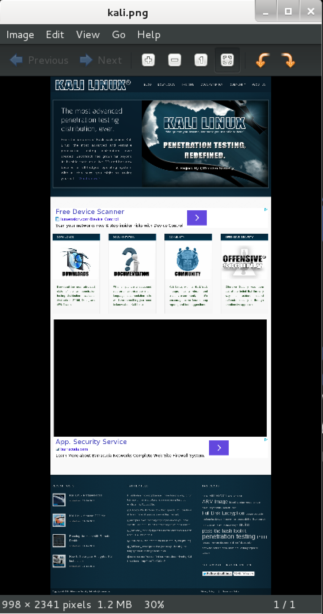

{}

## Screenshots



## cutycapt Usage Example

Take a capture of the URL (`–url=http://www.kali.org`) and save it to disk (`–out=kali.png`):

```
root@kali:~# cutycapt --url=http://www.kali.org --out=kali.png
libpng warning: iCCP: known incorrect sRGB profile
libpng warning: iCCP: known incorrect sRGB profile
```
