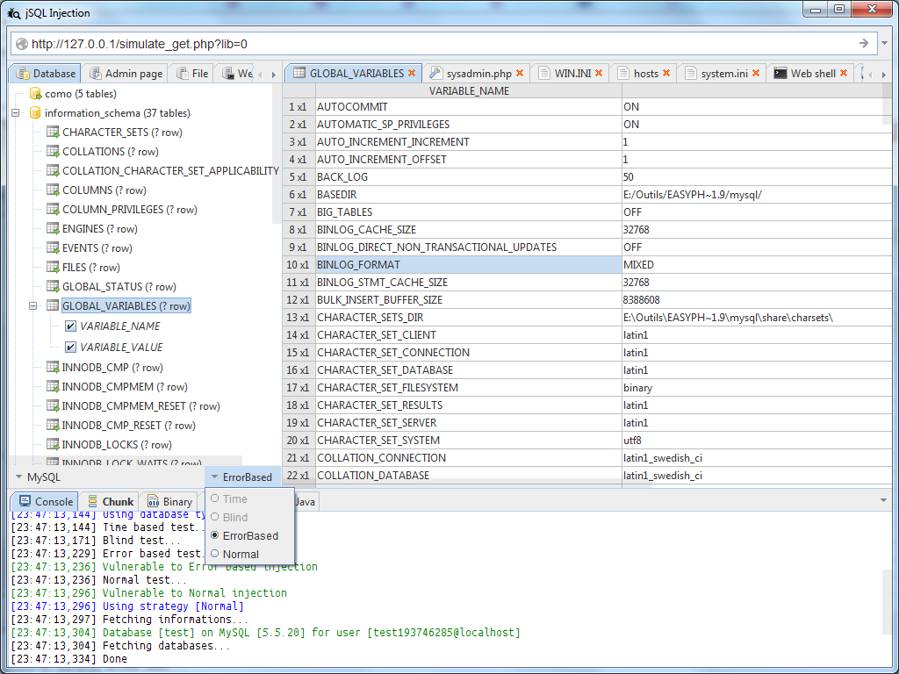
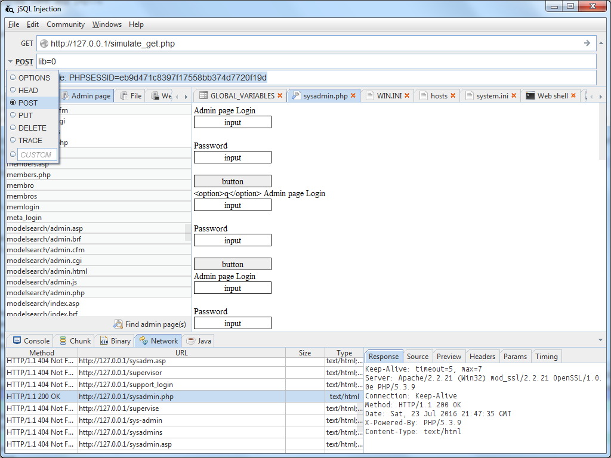
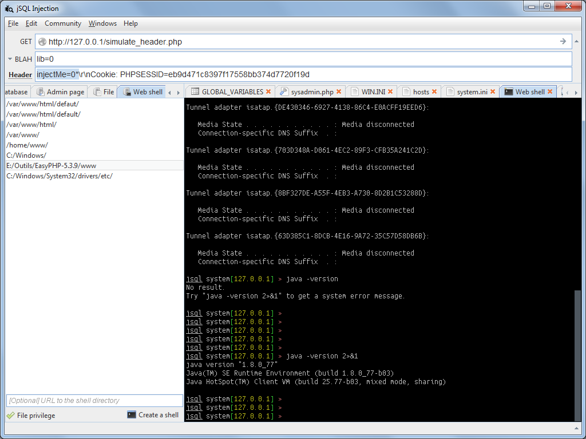

{}

## Description
**jSQL Injection** is a lightweight application used to find database information from a server.

It's **free**, **open source** and **cross-platform** and it works with Java from version 11 to 20.

The source code is available on Github: https://github.com/ron190/jsql-injection

## Features
- Automatic injection of 33 database engines: Access, Altibase, C-treeACE, CockroachDB, CUBRID, DB2, Derby, Exasol, Firebird, FrontBase, H2, Hana, HSQLDB, Informix, Ingres, InterSystems-IRIS, MaxDB, Mckoi, MemSQL, MimerSQL, MonetDB, MySQL, Neo4j, Netezza, NuoDB, Oracle, PostgreSQL, Presto, SQLite, SQL Server, Sybase, Teradata and Vertica
- Multiple injection strategies: Normal, Stacked, Error, Blind and Time
- Parallel bitwise Boolean Blind and Time strategies
- Various injection processes: Default, Zip, Dios
- Database fingerprint: Basic error, Order By error, Boolean single query
- Script sandboxes for SQL and tampering
- Inject multiple targets
- Read and write files using injection
- Create and display Web shell and SQL shell
- Bruteforce password hash
- Search for admin pages
- Hash, encode and decode text
- Authenticate using Basic, Digest, NTLM and Kerberos  
- Proxy connection on HTTP, SOCKS4 and SOCKS5

## Continuous integration
This software is developed using open source libraries like [Spring](https://spring.io), [Spock](http://spockframework.org) and [Hibernate](https://hibernate.org) and is tested using continuous integration platform Github Actions.<br> 
Non regression tests are run against dockerized and in memory databases and GUI is tested on VNC screen on the CI platform, then quality checks are stored on code quality platform.

## Screenshots

```
jsql
```



