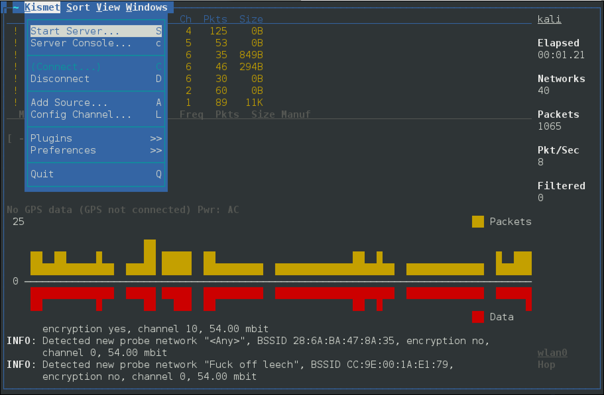

{}

## Screenshots

```
kismet
```



## kismet_client

```
root@kali:~# kismet_client -h
Usage: kismet_client [OPTION]
 *** Generic Options ***
 -h, --help                   The obvious
```

## kismet_drone

```
root@kali:~# kismet_drone -h
Usage: kismet_drone [OPTION]
Nearly all of these options are run-time overrides for values in the
kismet.conf configuration file.  Permanent changes should be made to
the configuration file.
 *** Generic Options ***
 -f, --config-file            Use alternate configuration file
     --no-line-wrap           Turn of linewrapping of output
                              (for grep, speed, etc)
 -s, --silent                 Turn off stdout output after setup phase
     --daemonize              Spawn detatched in the background

 *** Kismet Remote Drone Options ***
     --drone-listen           Override Kismet drone listen options

 *** Packet Capture Source Options ***
 -c, --capture-source         Specify a new packet capture source
                              (Identical syntax to the config file)
 -C, --enable-capture-sources Enable capture sources (comma-separated
                              list of names or interfaces)
```

## kismet_server Usage Example

Start the Kismet server, using the wireless interface as the capture source (`-c wlan0`) and use the external GPSD option (`–use-gpsd-gps`):

```
root@kali:~# kismet_server -c wlan0 --use-gpsd-gps
ERROR: Kismet was started as root, NOT launching external control binary.
       This is NOT the preferred method of starting Kismet as Kismet will
       continue to run as root the entire time.  Please read the README
       file section about Installation & Security and be sure this is what
       you want to do.
INFO: Reading from config file /etc/kismet/kismet.conf
INFO: No 'dronelisten' config line and no command line drone-listen
      argument given, Kismet drone server will not be enabled.
INFO: Created alert tracker...
INFO: Creating device tracker...
INFO: Registered 80211 PHY as id
```

