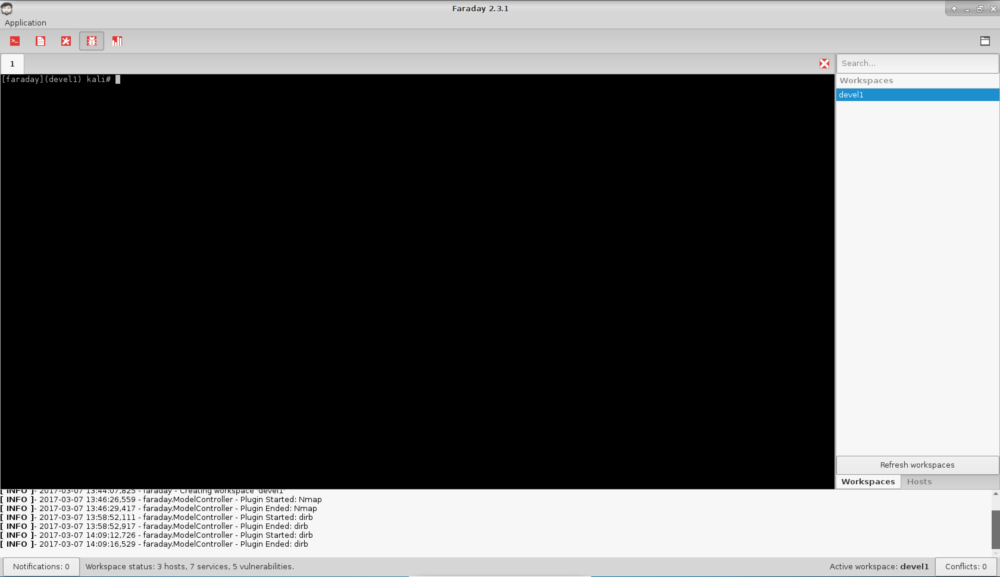
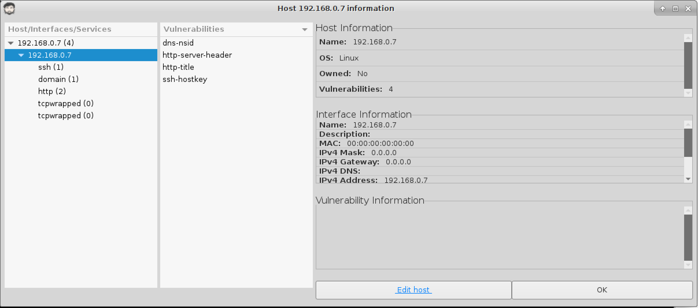
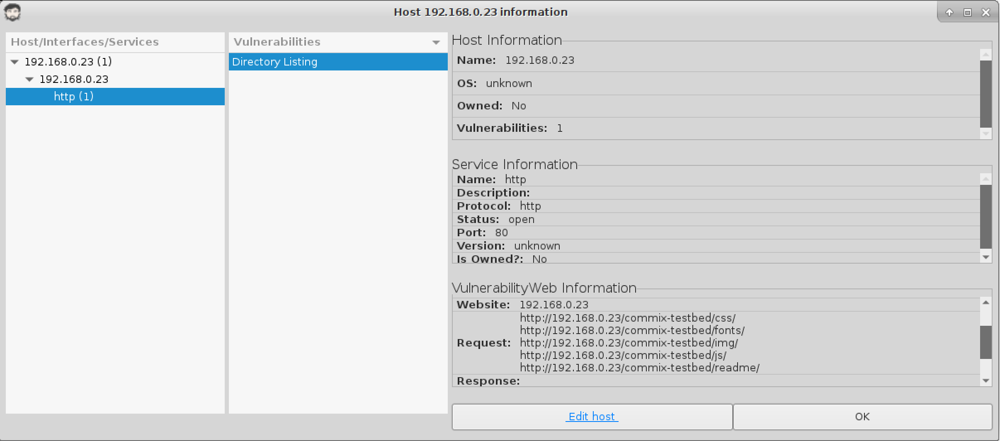
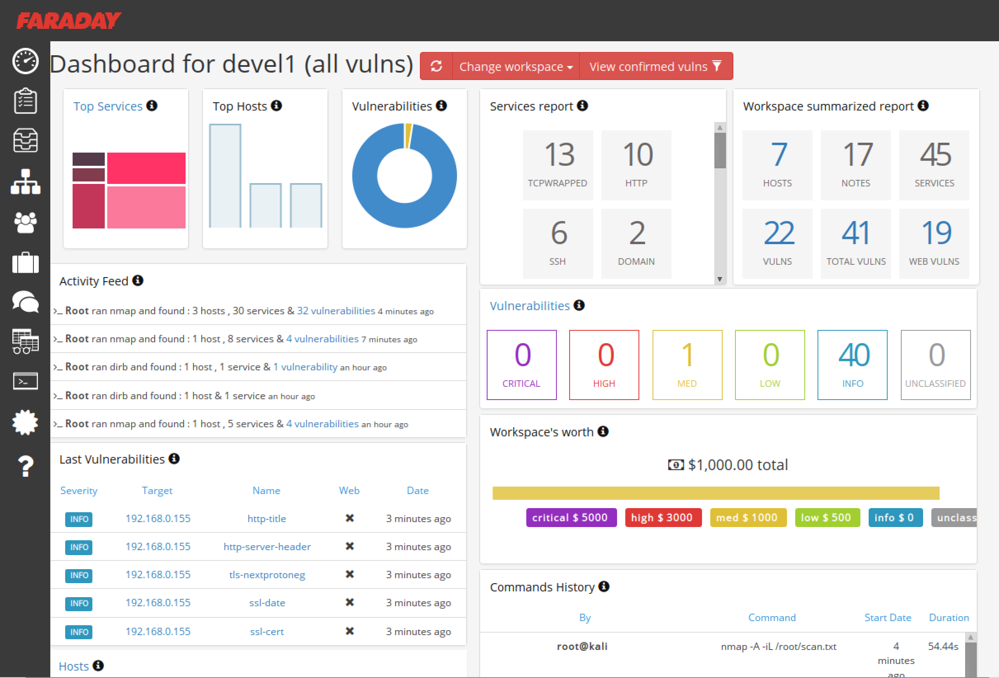

{}

## Screenshots



## Faraday Usage Examples

Faraday is a GUI application that consists of a ZSH terminal and a sidebar with details about your workspaces and hosts.

When Faraday supports the command you are running, it will automatically detect it and import the results. In the example below, the original nmap command that was entered was `nmap -A 192.168.0.7`, which Faraday converted on the fly.

```
>>> WELCOME TO FARADAY
[+] Current Workspace: dev1
[+] API: OK
[faraday](dev1) kali#  nmap -oX /root/.faraday/data/devel1_Nmap_output-3.46164772371.xml -A 192.168.0.7 2>&1 | tee -a tmp.tu0ldZUG2JgzuHvLOjBYEzBx3Bu7O

Starting Nmap 7.40 ( https://nmap.org ) at 2017-03-07 13:46 MST
Nmap scan report for pi-hole (192.168.0.7)
Host is up (0.0011s latency).
Not shown: 995 closed ports
PORT    STATE SERVICE    VERSION
22/tcp  open  ssh        OpenSSH 6.7p1 Raspbian 5+deb8u3 (protocol 2.0)
| ssh-hostkey:
|   1024 f7:5d:7c:e2:c5:46:32:19:08:e9:4b:79:5e:80:1c:83 (DSA)
|   2048 3c:f9:1d:ce:03:0f:2e:d2:17:05:77:af:81:54:32:fc (RSA)
|_  256 ea:20:d1:e0:e1:89:2c:65:9e:0d:d0:d0:e9:8b:9b:28 (ECDSA)
53/tcp  open  domain     dnsmasq 2.72
| dns-nsid:
|_  bind.version: dnsmasq-2.72
80/tcp  open  http       lighttpd 1.4.35
|_http-server-header: lighttpd/1.4.35
|_http-title: Welcome page
110/tcp open  tcpwrapped
143/tcp open  tcpwrapped
Device type: general purpose
Running: Linux 2.4.X|3.X
OS CPE: cpe:/o:linux:linux_kernel:2.4.37 cpe:/o:linux:linux_kernel:3.2
OS details: DD-WRT v24-sp2 (Linux 2.4.37), Linux 3.2
Network Distance: 2 hops
Service Info: OS: Linux; CPE: cpe:/o:linux:linux_kernel

TRACEROUTE (using port 80/tcp)
HOP RTT     ADDRESS
1   0.27 ms 172.16.206.2
2   0.21 ms pi-hole (192.168.0.7)

OS and Service detection performed. Please report any incorrect results at https://nmap.org/submit/ .
Nmap done: 1 IP address (1 host up) scanned in 18.41 seconds
[faraday](devel1) kali#
```

Once the nmap scan is finished, double-clicking on the host under the `Hosts` tab will bring up details about the host, its services, and any vulnerabilities that were detected.



The excellent dirb utility is also supported by Faraday by default:

```
[faraday](devel1) kali#  dirb http://192.168.0.23/commix-testbed -w 2>&1 | tee -a tmp.qNejUxvvrPpbGPVEfwf8OZOuM1F1E

-----------------
DIRB v2.22
By The Dark Raver
-----------------

START_TIME: Tue Mar  7 13:58:52 2017
URL_BASE: http://192.168.0.23/commix-testbed/
WORDLIST_FILES: /usr/share/dirb/wordlists/common.txt
OPTION: Not Stoping on warning messages

-----------------

GENERATED WORDS: 4612

---- Scanning URL: http://192.168.0.23/commix-testbed/ ----
==> DIRECTORY: http://192.168.0.23/commix-testbed/css/
==> DIRECTORY: http://192.168.0.23/commix-testbed/fonts/
==> DIRECTORY: http://192.168.0.23/commix-testbed/img/
+ http://192.168.0.23/commix-testbed/index.php (CODE:200|SIZE:14346)
==> DIRECTORY: http://192.168.0.23/commix-testbed/js/
==> DIRECTORY: http://192.168.0.23/commix-testbed/readme/

---- Entering directory: http://192.168.0.23/commix-testbed/css/ ----
(!) WARNING: Directory IS LISTABLE. No need to scan it.
    (Use mode '-w' if you want to scan it anyway)

---- Entering directory: http://192.168.0.23/commix-testbed/fonts/ ----
(!) WARNING: Directory IS LISTABLE. No need to scan it.
    (Use mode '-w' if you want to scan it anyway)

---- Entering directory: http://192.168.0.23/commix-testbed/img/ ----
(!) WARNING: Directory IS LISTABLE. No need to scan it.
    (Use mode '-w' if you want to scan it anyway)

---- Entering directory: http://192.168.0.23/commix-testbed/js/ ----
(!) WARNING: Directory IS LISTABLE. No need to scan it.
    (Use mode '-w' if you want to scan it anyway)

---- Entering directory: http://192.168.0.23/commix-testbed/readme/ ----
(!) WARNING: Directory IS LISTABLE. No need to scan it.
    (Use mode '-w' if you want to scan it anyway)

-----------------
END_TIME: Tue Mar  7 14:04:24 2017
DOWNLOADED: 27672 - FOUND: 1
```

When the scan is finished, double-clicking on the host will bring up its details, including the directories that dirb detected.



Take a look in the `/usr/share/python-faraday/plugins/repo` directory to see what other applications Faraday supports.

```
root@kali:/usr/share/python-faraday/plugins/repo# ls
acunetix  dnsrecon      listurl       netsparker     retina          wapiti
amap      dnswalk       maltego       nexpose        reverseraider   wcscan
appscan   fierce        masscan       nexpose-full   sentinel        webfuzzer
arachni   fruitywifi    medusa        nikto          skipfish        whois
arp-scan  ftp           metagoofil    nmap           sqlmap          wpscan
beef      goohost       metasploit    openvas        sshdefaultscan  x1
burp      hping3        metasploiton  pasteanalyzer  sslcheck        zap
dig       hydra         ndiff         peepingtom     telnet
dirb      impact        nessus        ping           theharvester
dnsenum   __init__.py   netcat        propecia       traceroute
dnsmap    __init__.pyc  netdiscover   qualysguard    w3af
```

Faraday also includes a full-featured web interface that provides you, your team, and any other interested parties with an immense amount of information.


