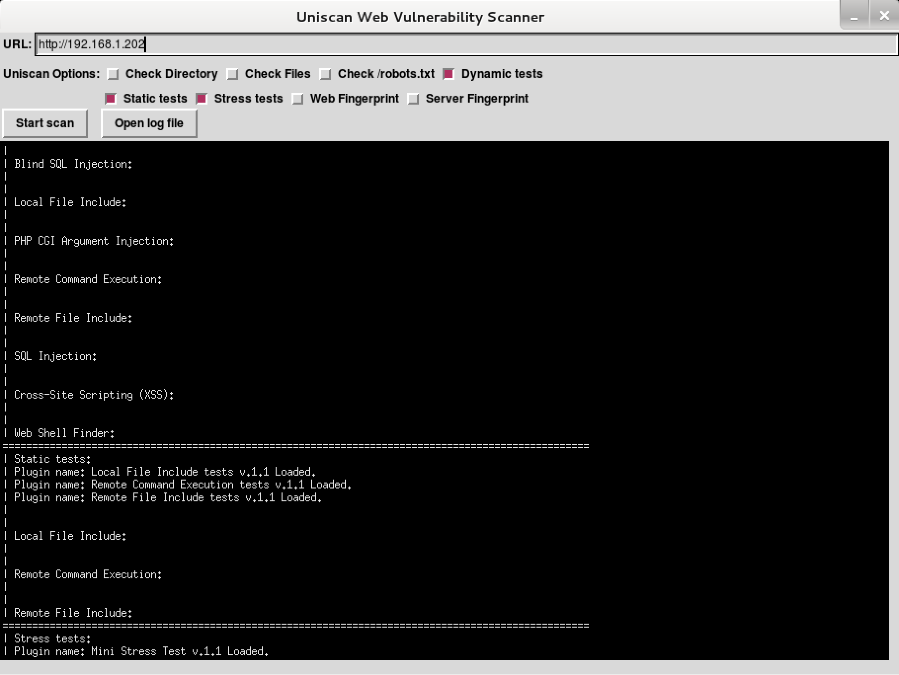

{}

## Screenshots

```
uniscan-gui
```



## uniscan Usage Example

Scan the given URL (`-u http://192.168.1.202/`) for vulnerabilities, enabling directory and dynamic checks (`-qd`):

```
root@kali:~# uniscan -u http://192.168.1.202/ -qd
####################################
# Uniscan project                  #
# http://uniscan.sourceforge.net/  #
####################################
V. 6.2


Scan date: 16-5-2014 16:29:48
===================================================================================================
| Domain: http://192.168.1.202/
| Server: Apache/2.2.22 (Debian)
| IP: 192.168.1.202
===================================================================================================
|
| Directory check:
| [+] CODE: 200 URL: http://192.168.1.202/joomla/
| [+] CODE: 200 URL: http://192.168.1.202/wordpress/
===================================================================================================
|
| Crawler Started:
| Plugin name: FCKeditor upload test v.1 Loaded.
| Plugin name: Web Backdoor Disclosure v.1.1 Loaded.
| Plugin name: phpinfo() Disclosure v.1 Loaded.
| Plugin name: E-mail Detection v.1.1 Loaded.
| Plugin name: Timthumb <= 1.32 vulnerability v.1 Loaded.
| Plugin name: Code Disclosure v.1.1 Loaded.
| Plugin name: Upload Form Detect v.1.1 Loaded.
| Plugin name: External Host Detect v.1.2 Loaded.
| [+] Crawling finished, 27 URL's found!
```
